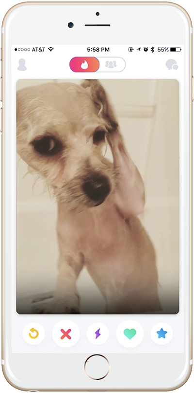

# 🐾 TinDog

> *Tinder, but for dogs. Find the love of your dog's life — or your money back.*

A fun, fully responsive landing page built with **HTML**, **CSS**, and **Bootstrap 5**. Originally a practice project from Angela Yu's Web Development Bootcamp, extended with a complete pricing section, call-to-action, and footer.

---

## 🖥️ Live Preview



---

## ✨ Features

- **Responsive Navbar** — collapses to a hamburger menu on mobile
- **Hero Section** — App Store & Google Play download buttons with an iPhone mockup
- **Features Section** — three icon-driven feature highlights
- **Testimonials** — social proof with a profile image
- **Press Logos** — TechCrunch, TNW, Business Insider, Mashable
- **Pricing Cards** — three tiers (Chihuahua · Labrador · Mastiff) with a featured "Popular" card
- **Call to Action** — gradient banner with platform download buttons
- **Footer** — brand, navigation links, and copyright

---

## 🛠️ Tech Stack

| Technology | Purpose |
|---|---|
| HTML5 | Structure |
| CSS3 | Custom styling & animations |
| Bootstrap 5.2 | Responsive grid & components |
| Font Awesome 6 | Icons |
| Google Fonts | Montserrat + Ubuntu typography |

---

## 📁 Project Structure

```
tindog/
├── index.html
├── css/
│   └── styles.css
└── images/
    ├── iphone6.png
    ├── dog-img.jpg
    ├── lady-img.jpg
    ├── techcrunch.png
    ├── tnw.png
    ├── bizinsider.png
    └── mashable.png
```

---

## 🚀 Getting Started

No build tools or dependencies required — just open it in a browser.

```bash
# Clone the repository
git clone https://github.com/your-username/tindog.git

# Navigate into the project
cd tindog

# Open in your browser
open index.html
```

Or simply drag `index.html` into any browser window.

---

## 📱 Responsive Design

The layout adapts cleanly across all screen sizes:

- **Desktop** — full multi-column layout with featured pricing card scaled up
- **Tablet** — stacked pricing cards, adjusted padding
- **Mobile** — collapsed navbar, single-column sections, larger press logos

---

## 🎨 Design Decisions

- Primary brand color `#ff4c68` (coral pink) used consistently across hero, testimonials, press, and CTA sections
- The **Labrador** pricing tier is highlighted as "Popular" with a gradient card, ribbon badge, and slight scale-up
- The CTA section uses a diagonal gradient with subtle paw-print watermarks for personality
- Footer uses a deep navy `#130f40` for strong visual contrast against the rest of the page

---

## 🙏 Credits

- Project inspired by [Dr. Angela Yu's](https://www.udemy.com/course/the-complete-web-development-bootcamp/) Web Development Bootcamp on Udemy
- Dog photo by [Unsplash](https://unsplash.com)
- Press logos belong to their respective owners

---

## 📄 License

This project is open source and available under the [MIT License](LICENSE).
